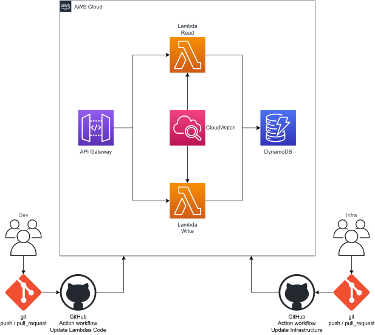
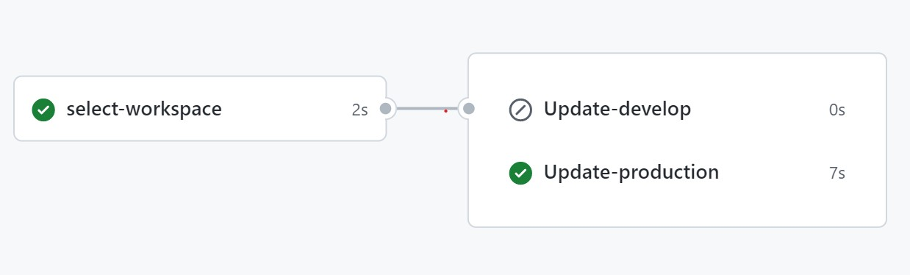

# AWS Lambdas

The goal of this repository is to automate the process of updating the code of an AWS lambda function through a GitHub action workflow.

## Architecture

The system's architecture is implemented on [AWS Cloud](https://aws.amazon.com/?nc1=h_ls) and consists of the following resources:

* 2 AWS Lambdas
* 2 CloudWatch Log groups
* 1 DynamoDB
* 1 API Gateway 

<div>
    
</div>

## Pipeline to Update Lambdas Code

The GitHub Actions workflow shown below is used to update the lambda function code:

<div>
    
</div>

A GitHub context-based condition has been implemented to select which lambdas to update, i.e. those in production or those in development. This is achieved through the following [workflow](.github/workflows/deploy2lambda.yml):

```
name: Update aws lambdas function code

run-name: ${{ github.actor }} is updating aws lambdas function code 🚀

on:
  pull_request:
    types:
      - closed
    branches:
      - develop
      - main
  push:
    branches:
      - develop

# Env variables MUST be the same used on terraform

env:
  AWS_REGION: us-east-1
  TABLE_NAME: books

jobs:

  select-workspace:
    
    runs-on: ubuntu-latest
    outputs:
      workspace:  ${{ steps.set-workspace.outputs.workspace }}
    
    steps:

      - name: Set workspace
        id: set-workspace
        run: |
          if [[ $GITHUB_EVENT_NAME == "pull_request" ]]; then
            echo "workspace=$GITHUB_BASE_REF" >> $GITHUB_OUTPUT
          else
            echo "workspace=$GITHUB_REF_NAME" >> $GITHUB_OUTPUT
          fi

  Update-develop:
    
    needs: select-workspace
    if: needs.select-workspace.outputs.workspace == 'develop'

    runs-on: ubuntu-latest
    env:
      WORKSPACE: ${{ needs.select-workspace.outputs.workspace }}
      WORKSPACE_ID: bFgYGXqNsLQ # Develop workspace id
    
    steps:

      - name: Checkout
        uses: actions/checkout@v3

      - name: Install aws
        uses: aws-actions/configure-aws-credentials@v1-node16
        with:
          aws-access-key-id: ${{ secrets.AWS_ACCESS_KEY_ID }}
          aws-secret-access-key: ${{ secrets.AWS_SECRET_ACCESS_KEY }}
          aws-region: ${{ env.AWS_REGION }}

      - name: Adequate functions
        run: |
          sed -i "s|$TABLE_NAME|$TABLE_NAME-$WORKSPACE|g" http-read/index.js
          sed -i "s|$TABLE_NAME|$TABLE_NAME-$WORKSPACE|g" http-write/index.js

      - name: zip read function
        run: |
          if [[ -e index.zip ]]; then
            rm index.zip
          else
            cd http-read && zip -r9 ../index.zip *
          fi
        
      - name: update read function
        run: |
          aws lambda update-function-code --region $AWS_REGION \
          --function-name "http-read-$AWS_REGION-$WORKSPACE-$WORKSPACE_ID" \
          --zip-file "fileb://index.zip"
      
      - name: zip write function
        run: |
          if [[ -e index.zip ]]; then
            rm index.zip
          fi
          cd http-write && zip -r9 ../index.zip *
        
      - name: update write function
        run: |
          aws lambda update-function-code --region $AWS_REGION \
          --function-name "http-write-$AWS_REGION-$WORKSPACE-$WORKSPACE_ID" \
          --zip-file "fileb://index.zip"

  Update-production:
    
    needs: select-workspace
    if: needs.select-workspace.outputs.workspace == 'main'

    runs-on: ubuntu-latest
    env:
      WORKSPACE: ${{ needs.select-workspace.outputs.workspace }}
      WORKSPACE_ID: zWazvHiGVQc # production workspace id
    
    steps:

      - name: Checkout
        uses: actions/checkout@v3

      - name: Install aws
        uses: aws-actions/configure-aws-credentials@v1-node16
        with:
          aws-access-key-id: ${{ secrets.AWS_ACCESS_KEY_ID }}
          aws-secret-access-key: ${{ secrets.AWS_SECRET_ACCESS_KEY }}
          aws-region: ${{ env.AWS_REGION }}

      - name: zip read function
        run: |
          if [[ -e index.zip ]]; then
            rm index.zip
          else
            cd http-read && zip -r9 ../index.zip *
          fi
        
      - name: update read function
        run: |
          aws lambda update-function-code --region $AWS_REGION \
          --function-name "http-read-$AWS_REGION-$WORKSPACE-$WORKSPACE_ID" \
          --zip-file "fileb://index.zip"
      
      - name: zip write function
        run: |
          if [[ -e index.zip ]]; then
            rm index.zip
          fi
          cd http-write && zip -r9 ../index.zip *
        
      - name: update write function
        run: |
          aws lambda update-function-code --region $AWS_REGION \
          --function-name "http-write-$AWS_REGION-$WORKSPACE-$WORKSPACE_ID" \
          --zip-file "fileb://index.zip"
```
